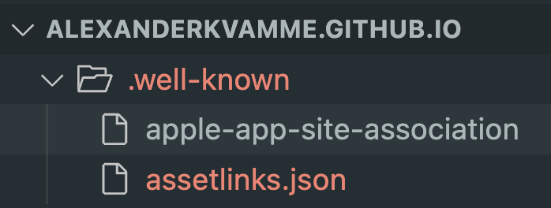

# Telenor Handover Document

# Intro

The example web-project is temporarily hosted at: [https://alexanderkvamme.github.io/](https://alexanderkvamme.github.io/)

The point of hosting a website like this is to be able to open the app from a website or a link.

Leading the user to `[https://alexanderkvamme.github.io/app/?sessionId=12345](https://alexanderkvamme.github.io/app/?sessionId=12345)` on a mobile device will lead the user to app/play store if they dont have the app installed. If they DO have the app installed though, the app will open, and the sessionId will be passed in for the app to use for the rest of the identity proofing session.

If the user is on a computer, a QR-code will be displayed that the user can scan with a mobile device to get redirected to the appropriate app or app store.

# How does it work?

To be able to use univer linking or app linking, you must control a domain and place one file for android `assetlinks.json` and one file for Apple `apple-app-site-associateion`.

These files will be a proof that there is a ownership connection between your app/play store entry and the domain, and will enable the opening of your app from a QR-code/URL/link



# Setting up the .well-known resources

### Apple (apple-app-site-association)

After you make an app store entry for your app, you can get the data you need to update  apple-app-site-association. 

Use this format `<Application Identifier Prefix>.<Bundle Identifier>`

`<Application Identifier Prefix>` should actually be your teams ID.. So go to [apple developer center](https://developer.apple.com/account/resources/certificates/list) and in the top right.


`<Bundle Identifier>` should be the app bundle’s identifier. For example `com.tietoevry.saa.ios.telenor`

In the end, the combined final value should be something like this: `54KTRMAZEH.com.tietoevry.saa.ios.telenor`

### Android (assetlinks.json)

When you make a Play store entry for the app, you can get the `sha_256_cert_fingerprints` from the play store site. For example see [this link on stack overflow](https://stackoverflow.com/questions/71399617/how-to-get-sha256-cert-fingerprints-for-assetlinks-json-for-expo). Use that to update the corresponding `applinks.json` value.

# Redirection

In the example web-project, the redireciton happens in `app/index.html`

So when a user enters for example [https://alexanderkvamme.github.io/](https://alexanderkvamme.github.io/)app, a Javascript script will run and redirect to app store or play store depending on what platform they are on.

# URL parameters

`https://alexanderkvamme.github.io/app/?sessionId=12345`

This will pass in sessionId 12345 to the app when it opens, and the app will use this sessionId when going through the identity proofing flow.

You will have to host the web-project files somwhere else, and you will need to set your QR-code generation endpoint to direct to that repo.

# Notes

### Removable header in assetlinks.json

The header in `assetlinks.json` is only needed for some websites such as github pages (github.io). So you should be able to remove this when you find a more permanent host.

```jsx
---
layout: none
permalink: .well-known/assetlinks.json
---
```

### iOS app does not currently exist on App store

Therefore if you dont have the app installed from testflight/xcode, you will be lead to nonexisting webiste `FIXME-MISSING-LINK-TO-APP-STORE`. After releasing the app properly, you can update this link to lead to it the app store entry.
